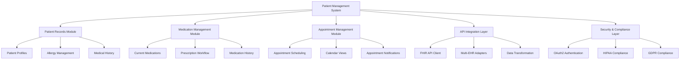
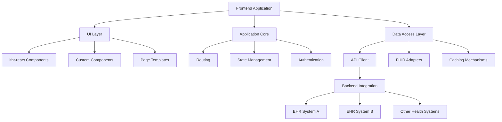
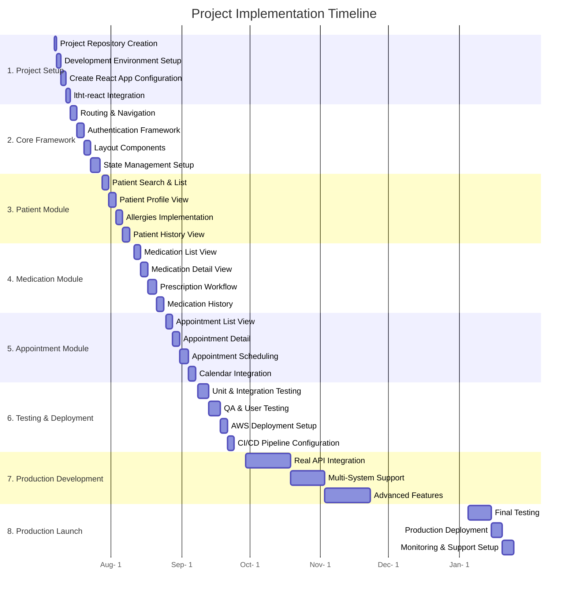
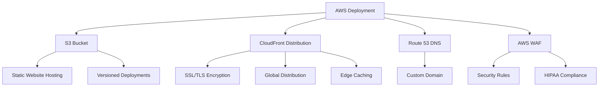

# Healthcare Patient Management System - Implementation Plan

## Project Overview



## 1. Technical Architecture



## 2. Detailed Implementation Timeline



## 3. Phase 1: Development Environment Setup (Week 1)

### 3.1 Project Repository Setup

```json
// package.json (initial configuration)
{
  "name": "patient-management-system",
  "version": "0.1.0",
  "private": true,
  "dependencies": {
    "@emotion/react": "^11.0.0",
    "@emotion/styled": "^11.0.0",
    "@ltht-react/allergy-detail": "^2.0.148",
    "@ltht-react/allergy-summary": "^2.0.148",
    "@ltht-react/appointment-detail": "^2.0.148",
    "@ltht-react/appointment-summary": "^2.0.148",
    "@ltht-react/flag-detail": "^2.0.148",
    "@ltht-react/flag-summary": "^2.0.148",
    "@ltht-react/medication-detail": "^2.0.148",
    "@ltht-react/medication-summary": "^2.0.148",
    "@ltht-react/patient-banner": "^2.0.148",
    "@ltht-react/styles": "^2.0.148",
    "@ltht-react/types": "^2.0.148",
    "@ltht-react/utils": "^2.0.148",
    "axios": "^1.8.4",
    "react": "^18.2.0",
    "react-dom": "^18.2.0",
    "react-router-dom": "^6.20.0",
    "web-vitals": "^3.5.0"
  },
  "devDependencies": {
    "@testing-library/jest-dom": "^6.2.0",
    "@testing-library/react": "^14.1.2",
    "@testing-library/user-event": "^14.5.2",
    "@types/jest": "^29.5.0",
    "@types/node": "^18.0.0",
    "@types/react": "^18.2.38",
    "@types/react-dom": "^18.2.17",
    "eslint": "^8.19.0",
    "eslint-config-prettier": "^8.5.0",
    "prettier": "^2.0.0",
    "typescript": "^5.3.0"
  },
  "scripts": {
    "start": "react-scripts start",
    "build": "react-scripts build",
    "test": "react-scripts test",
    "eject": "react-scripts eject",
    "lint": "eslint src --ext .ts,.tsx",
    "lint:fix": "eslint src --ext .ts,.tsx --fix",
    "format": "prettier --write \"src/**/*.{ts,tsx}\""
  }
}
```

### 3.2 Project Structure Setup

```
/patient-management-system
├── public/
│   └── index.html
├── src/
│   ├── assets/
│   ├── components/
│   │   ├── common/
│   │   ├── layout/
│   │   ├── patient/
│   │   ├── medication/
│   │   └── appointment/
│   ├── contexts/
│   ├── hooks/
│   ├── pages/
│   ├── services/
│   │   ├── api/
│   │   ├── auth/
│   │   └── mock/
│   ├── types/
│   ├── utils/
│   ├── App.tsx
│   ├── index.tsx
│   └── theme.ts
├── .eslintrc.js
├── .gitignore
├── .prettierrc
├── package.json
├── README.md
└── tsconfig.json
```

### 3.3 Create React App Installation & Configuration

Set up the project with the following commands:

```bash
# Create project with TypeScript template
npx create-react-app patient-management-system --template typescript

# Install ltht-react components and dependencies
cd patient-management-system
npm install @ltht-react/allergy-detail @ltht-react/allergy-summary \
  @ltht-react/appointment-detail @ltht-react/appointment-summary \
  @ltht-react/flag-detail @ltht-react/flag-summary \
  @ltht-react/medication-detail @ltht-react/medication-summary \
  @ltht-react/patient-banner @ltht-react/styles @ltht-react/types @ltht-react/utils

# Install other dependencies
npm install axios react-router-dom

# Install development dependencies
npm install --save-dev eslint prettier eslint-config-prettier
```

### 3.4 Theme & Styling Configuration

```tsx
// src/theme.ts
import { getTheme } from '@ltht-react/styles';

export const theme = getTheme({
  colorMode: 'light',
  // Any customizations can be added here
});

// src/index.tsx
import React from 'react';
import ReactDOM from 'react-dom/client';
import { ThemeProvider } from '@emotion/react';
import { theme } from './theme';
import App from './App';

const root = ReactDOM.createRoot(
  document.getElementById('root') as HTMLElement
);
root.render(
  <React.StrictMode>
    <ThemeProvider theme={theme}>
      <App />
    </ThemeProvider>
  </React.StrictMode>
);
```

## 4. Phase 2: Core Application Framework (Weeks 2-3)

### 4.1 Routing & Navigation

```tsx
// src/App.tsx
import React from 'react';
import { BrowserRouter, Routes, Route, Navigate } from 'react-router-dom';
import { AuthProvider } from './contexts/AuthContext';
import { PatientProvider } from './contexts/PatientContext';
import ProtectedRoute from './components/common/ProtectedRoute';
import MainLayout from './components/layout/MainLayout';
import Dashboard from './pages/Dashboard';
import PatientList from './pages/patient/PatientList';
import PatientDetail from './pages/patient/PatientDetail';
import MedicationList from './pages/medication/MedicationList';
import MedicationDetail from './pages/medication/MedicationDetail';
import AppointmentList from './pages/appointment/AppointmentList';
import AppointmentDetail from './pages/appointment/AppointmentDetail';
import Login from './pages/Login';

const App: React.FC = () => {
  return (
    <BrowserRouter>
      <AuthProvider>
        <Routes>
          <Route path="/login" element={<Login />} />
          <Route
            path="/"
            element={
              <ProtectedRoute>
                <MainLayout />
              </ProtectedRoute>
            }
          >
            <Route index element={<Dashboard />} />
            <Route path="patients">
              <Route index element={<PatientList />} />
              <Route
                path=":patientId"
                element={
                  <PatientProvider>
                    <PatientDetail />
                  </PatientProvider>
                }
              />
            </Route>
            <Route path="medications">
              <Route index element={<MedicationList />} />
              <Route path=":medicationId" element={<MedicationDetail />} />
            </Route>
            <Route path="appointments">
              <Route index element={<AppointmentList />} />
              <Route path=":appointmentId" element={<AppointmentDetail />} />
            </Route>
            <Route path="*" element={<Navigate to="/" replace />} />
          </Route>
        </Routes>
      </AuthProvider>
    </BrowserRouter>
  );
};

export default App;
```

### 4.2 Authentication Context

```tsx
// src/contexts/AuthContext.tsx
import React, { createContext, useContext, useState, useEffect } from 'react';
import { authService } from '../services/auth/authService';

interface AuthContextType {
  isAuthenticated: boolean;
  user: any | null;
  login: (username: string, password: string) => Promise<void>;
  logout: () => void;
  isLoading: boolean;
  error: string | null;
}

const AuthContext = createContext<AuthContextType | undefined>(undefined);

export const AuthProvider: React.FC<{ children: React.ReactNode }> = ({ children }) => {
  const [isAuthenticated, setIsAuthenticated] = useState<boolean>(false);
  const [user, setUser] = useState<any | null>(null);
  const [isLoading, setIsLoading] = useState<boolean>(true);
  const [error, setError] = useState<string | null>(null);

  useEffect(() => {
    // Check for existing token and validate
    const initializeAuth = async () => {
      setIsLoading(true);
      try {
        const currentUser = await authService.getCurrentUser();
        if (currentUser) {
          setUser(currentUser);
          setIsAuthenticated(true);
        }
      } catch (err) {
        console.error('Auth initialization error:', err);
        // Clear invalid auth state
        authService.logout();
      } finally {
        setIsLoading(false);
      }
    };

    initializeAuth();
  }, []);

  const login = async (username: string, password: string) => {
    setIsLoading(true);
    setError(null);
    try {
      const userData = await authService.login(username, password);
      setUser(userData);
      setIsAuthenticated(true);
    } catch (err: any) {
      setError(err.message || 'Login failed');
      throw err;
    } finally {
      setIsLoading(false);
    }
  };

  const logout = () => {
    authService.logout();
    setUser(null);
    setIsAuthenticated(false);
  };

  return (
    <AuthContext.Provider
      value={{ isAuthenticated, user, login, logout, isLoading, error }}
    >
      {children}
    </AuthContext.Provider>
  );
};

export const useAuth = (): AuthContextType => {
  const context = useContext(AuthContext);
  if (context === undefined) {
    throw new Error('useAuth must be used within an AuthProvider');
  }
  return context;
};
```

### 4.3 Main Layout Component

```tsx
// src/components/layout/MainLayout.tsx
import React from 'react';
import { Outlet } from 'react-router-dom';
import styled from '@emotion/styled';
import Header from './Header';
import Sidebar from './Sidebar';
import { useAuth } from '../../contexts/AuthContext';

const LayoutContainer = styled.div`
  display: flex;
  flex-direction: column;
  min-height: 100vh;
`;

const ContentContainer = styled.div`
  display: flex;
  flex: 1;
`;

const MainContent = styled.main`
  flex: 1;
  padding: 1.5rem;
  overflow-y: auto;
`;

const MainLayout: React.FC = () => {
  const { user } = useAuth();

  return (
    <LayoutContainer>
      <Header username={user?.name} />
      <ContentContainer>
        <Sidebar />
        <MainContent>
          <Outlet />
        </MainContent>
      </ContentContainer>
    </LayoutContainer>
  );
};

export default MainLayout;
```

### 4.4 API Client Setup

```tsx
// src/services/api/apiClient.ts
import axios, { AxiosInstance, AxiosRequestConfig, AxiosResponse } from 'axios';
import { authService } from '../auth/authService';

class ApiClient {
  private client: AxiosInstance;
  private baseUrl: string;

  constructor(baseUrl: string) {
    this.baseUrl = baseUrl;
    this.client = axios.create({
      baseURL: baseUrl,
      timeout: 30000,
      headers: {
        'Content-Type': 'application/json',
      },
    });

    this.setupInterceptors();
  }

  private setupInterceptors(): void {
    // Request interceptor for API calls
    this.client.interceptors.request.use(
      async (config) => {
        const token = authService.getToken();
        if (token) {
          config.headers = config.headers || {};
          config.headers.Authorization = `Bearer ${token}`;
        }
        return config;
      },
      (error) => {
        Promise.reject(error);
      }
    );

    // Response interceptor for API calls
    this.client.interceptors.response.use(
      (response) => response,
      async (error) => {
        const originalRequest = error.config;
        // Handle token refresh if 401 and not already retrying
        if (error.response?.status === 401 && !originalRequest._retry) {
          originalRequest._retry = true;
          try {
            await authService.refreshToken();
            const token = authService.getToken();
            this.client.defaults.headers.common.Authorization = `Bearer ${token}`;
            return this.client(originalRequest);
          } catch (refreshError) {
            // Refresh token failed, redirect to login
            authService.logout();
            window.location.href = '/login';
            return Promise.reject(refreshError);
          }
        }
        return Promise.reject(error);
      }
    );
  }

  async get<T>(url: string, config?: AxiosRequestConfig): Promise<T> {
    const response: AxiosResponse<T> = await this.client.get<T>(url, config);
    return response.data;
  }

  async post<T>(url: string, data?: any, config?: AxiosRequestConfig): Promise<T> {
    const response: AxiosResponse<T> = await this.client.post<T>(url, data, config);
    return response.data;
  }

  async put<T>(url: string, data?: any, config?: AxiosRequestConfig): Promise<T> {
    const response: AxiosResponse<T> = await this.client.put<T>(url, data, config);
    return response.data;
  }

  async delete<T>(url: string, config?: AxiosRequestConfig): Promise<T> {
    const response: AxiosResponse<T> = await this.client.delete<T>(url, config);
    return response.data;
  }
}

// Use environment variables for configuration
const API_BASE_URL = process.env.REACT_APP_API_BASE_URL || 'https://api.example.com';

export const apiClient = new ApiClient(API_BASE_URL);
```

## 5. Phase 3: Patient Module Development (Week 3-4)

### 5.1 Patient Context

```tsx
// src/contexts/PatientContext.tsx
import React, { createContext, useContext, useState, useEffect } from 'react';
import { useParams } from 'react-router-dom';
import { patientService } from '../services/api/patientService';
import { Patient } from '@ltht-react/types';

interface PatientContextType {
  patient: Patient | null;
  isLoading: boolean;
  error: string | null;
  refreshPatient: () => Promise<void>;
}

const PatientContext = createContext<PatientContextType | undefined>(undefined);

export const PatientProvider: React.FC<{ children: React.ReactNode }> = ({ children }) => {
  const { patientId } = useParams<{ patientId: string }>();
  const [patient, setPatient] = useState<Patient | null>(null);
  const [isLoading, setIsLoading] = useState<boolean>(true);
  const [error, setError] = useState<string | null>(null);

  const fetchPatient = async () => {
    if (!patientId) return;
    
    setIsLoading(true);
    setError(null);
    try {
      const patientData = await patientService.getPatient(patientId);
      setPatient(patientData);
    } catch (err: any) {
      setError(err.message || 'Failed to load patient data');
      console.error('Error fetching patient:', err);
    } finally {
      setIsLoading(false);
    }
  };

  useEffect(() => {
    fetchPatient();
  }, [patientId]);

  const refreshPatient = async () => {
    await fetchPatient();
  };

  return (
    <PatientContext.Provider value={{ patient, isLoading, error, refreshPatient }}>
      {children}
    </PatientContext.Provider>
  );
};

export const usePatient = (): PatientContextType => {
  const context = useContext(PatientContext);
  if (context === undefined) {
    throw new Error('usePatient must be used within a PatientProvider');
  }
  return context;
};
```

### 5.2 Patient List Page

```tsx
// src/pages/patient/PatientList.tsx
import React, { useState, useEffect } from 'react';
import { useNavigate } from 'react-router-dom';
import { Card } from '@ltht-react/card';
import { List } from '@ltht-react/list';
import { Input } from '@ltht-react/input';
import { Button } from '@ltht-react/button';
import { patientService } from '../../services/api/patientService';
import { Patient } from '@ltht-react/types';
import PatientListItem from '../../components/patient/PatientListItem';
import LoadingSpinner from '../../components/common/LoadingSpinner';
import ErrorMessage from '../../components/common/ErrorMessage';

const PatientList: React.FC = () => {
  const navigate = useNavigate();
  const [patients, setPatients] = useState<Patient[]>([]);
  const [filteredPatients, setFilteredPatients] = useState<Patient[]>([]);
  const [isLoading, setIsLoading] = useState<boolean>(true);
  const [error, setError] = useState<string | null>(null);
  const [searchTerm, setSearchTerm] = useState<string>('');

  useEffect(() => {
    const fetchPatients = async () => {
      setIsLoading(true);
      setError(null);
      try {
        const data = await patientService.getPatients();
        setPatients(data);
        setFilteredPatients(data);
      } catch (err: any) {
        setError(err.message || 'Failed to load patients');
      } finally {
        setIsLoading(false);
      }
    };

    fetchPatients();
  }, []);

  useEffect(() => {
    if (searchTerm.trim() === '') {
      setFilteredPatients(patients);
    } else {
      const lowercaseSearch = searchTerm.toLowerCase();
      const filtered = patients.filter((patient) => {
        const name = `${patient.name[0]?.given?.join(' ')} ${patient.name[0]?.family}`.toLowerCase();
        const id = patient.id?.toLowerCase() || '';
        return name.includes(lowercaseSearch) || id.includes(lowercaseSearch);
      });
      setFilteredPatients(filtered);
    }
  }, [searchTerm, patients]);

  const handlePatientClick = (patientId: string) => {
    navigate(`/patients/${patientId}`);
  };

  if (isLoading) return <LoadingSpinner />;
  if (error) return <ErrorMessage message={error} />;

  return (
    <div>
      <h1>Patients</h1>
      <div style={{ marginBottom: '20px', display: 'flex', gap: '10px' }}>
        <Input
          label="Search patients"
          value={searchTerm}
          onChange={(e) => setSearchTerm(e.target.value)}
          placeholder="Search by name or ID..."
          style={{ flexGrow: 1 }}
        />
        <Button>Advanced Search</Button>
      </div>
      <Card>
        <Card.Header title={`Patient List (${filteredPatients.length})`} />
        <Card.Body>
          <List>
            {filteredPatients.map((patient) => (
              <List.Item key={patient.id}>
                <PatientListItem
                  patient={patient}
                  onClick={() => handlePatientClick(patient.id)}
                />
              </List.Item>
            ))}
            {filteredPatients.length === 0 && (
              <p>No patients found matching your search criteria.</p>
            )}
          </List>
        </Card.Body>
      </Card>
    </div>
  );
};

export default PatientList;
```

### 5.3 Patient Detail Page

```tsx
// src/pages/patient/PatientDetail.tsx
import React, { useState } from 'react';
import { PatientBanner } from '@ltht-react/patient-banner';
import { FlagSummary } from '@ltht-react/flag-summary';
import { FlagDetail } from '@ltht-react/flag-detail';
import { AllergySummary } from '@ltht-react/allergy-summary';
import { AllergyDetail } from '@ltht-react/allergy-detail';
import { Card } from '@ltht-react/card';
import { Button } from '@ltht-react/button';
import { usePatient } from '../../contexts/PatientContext';
import { patientService } from '../../services/api/patientService';
import LoadingSpinner from '../../components/common/LoadingSpinner';
import ErrorMessage from '../../components/common/ErrorMessage';
import TabNavigation from '../../components/common/TabNavigation';
import MedicationTab from '../../components/patient/MedicationTab';
import AppointmentTab from '../../components/patient/AppointmentTab';

const PatientDetail: React.FC = () => {
  const { patient, isLoading, error } = usePatient();
  const [activeTab, setActiveTab] = useState<string>('overview');
  const [selectedFlag, setSelectedFlag] = useState<string | null>(null);
  const [selectedAllergy, setSelectedAllergy] = useState<string | null>(null);

  const tabs = [
    { id: 'overview', label: 'Overview' },
    { id: 'medications', label: 'Medications' },
    { id: 'appointments', label: 'Appointments' },
    { id: 'documents', label: 'Documents' },
  ];

  const handleFlagClick = (flagId: string) => {
    setSelectedFlag(flagId === selectedFlag ? null : flagId);
  };

  const handleAllergyClick = (allergyId: string) => {
    setSelectedAllergy(allergyId === selectedAllergy ? null : allergyId);
  };

  if (isLoading) return <LoadingSpinner />;
  if (error) return <ErrorMessage message={error} />;
  if (!patient) return <ErrorMessage message="Patient not found" />;

  const renderActiveTab = () => {
    switch (activeTab) {
      case 'overview':
        return (
          <div>
            <div style={{ display: 'flex', gap: '20px', marginBottom: '20px' }}>
              <Card style={{ flex: 1 }}>
                <Card.Header title="Alerts" />
                <Card.Body>
                  <FlagSummary
                    flags={patient.flags || []}
                    handleClick={handleFlagClick}
                  />
                  {selectedFlag && (
                    <FlagDetail
                      flag={patient.flags?.find(f => f.id === selectedFlag) || null}
                    />
                  )}
                </Card.Body>
              </Card>
              <Card style={{ flex: 1 }}>
                <Card.Header title="Allergies" />
                <Card.Body>
                  <AllergySummary
                    allergies={patient.allergies || []}
                    handleClick={handleAllergyClick}
                  />
                  {selectedAllergy && (
                    <AllergyDetail
                      allergy={patient.allergies?.find(a => a.id === selectedAllergy) || null}
                    />
                  )}
                </Card.Body>
              </Card>
            </div>
            {/* Additional overview sections */}
          </div>
        );
      case 'medications':
        return <MedicationTab patientId={patient.id} />;
      case 'appointments':
        return <AppointmentTab patientId={patient.id} />;
      case 'documents':
        return <div>Documents tab content</div>;
      default:
        return <div>Select a tab</div>;
    }
  };

  return (
    <div>
      <PatientBanner patient={patient} />
      <div style={{ marginTop: '20px', marginBottom: '20px' }}>
        <TabNavigation
          tabs={tabs}
          activeTab={activeTab}
          onTabChange={setActiveTab}
        />
      </div>
      {renderActiveTab()}
    </div>
  );
};

export default PatientDetail;
```

## 6. Phase 4: Medication Management Module (Week 5)

### 6.1 Medication List Component

```tsx
// src/components/patient/MedicationTab.tsx
import React, { useState, useEffect } from 'react';
import { Card } from '@ltht-react/card';
import { MedicationSummary } from '@ltht-react/medication-summary';
import { MedicationDetail } from '@ltht-react/medication-detail';
import { Button } from '@ltht-react/button';
import { medicationService } from '../../services/api/medicationService';
import { Medication } from '@ltht-react/types';
import LoadingSpinner from '../common/LoadingSpinner';
import ErrorMessage from '../common/ErrorMessage';

interface MedicationTabProps {
  patientId: string;
}

const MedicationTab: React.FC<MedicationTabProps> = ({ patientId }) => {
  const [medications, setMedications] = useState<Medication[]>([]);
  const [selectedMedication, setSelectedMedication] = useState<string | null>(null);
  const [isLoading, setIsLoading] = useState<boolean>(true);
  const [error, setError] = useState<string | null>(null);

  useEffect(() => {
    const fetchMedications = async () => {
      setIsLoading(true);
      setError(null);
      try {
        const data = await medicationService.getPatientMedications(patientId);
        setMedications(data);
      } catch (err: any) {
        setError(err.message || 'Failed to load medications');
      } finally {
        setIsLoading(false);
      }
    };

    fetchMedications();
  }, [patientId]);

  const handleMedicationClick = (medicationId: string) => {
    setSelectedMedication(medicationId === selectedMedication ? null : medicationId);
  };

  const handlePrescribe = () => {
    // Navigate to prescription form
    window.location.href = `/patients/${patientId}/prescribe`;
  };

  if (isLoading) return <LoadingSpinner />;
  if (error) return <ErrorMessage message={error} />;

  return (
    <div>
      <div style={{ display: 'flex', justifyContent: 'space-between', marginBottom: '20px' }}>
        <h2>Medications</h2>
        <Button onClick={handlePrescribe}>New Prescription</Button>
      </div>

      <Card>
        <Card.Header title="Current Medications" />
        <Card.Body>
          {medications.length > 0 ? (
            <MedicationSummary
              medications={medications}
              handleClick={handleMedicationClick}
            />
          ) : (
            <p>No current medications found.</p>
          )}
        </Card.Body>
      </Card>

      {selectedMedication && (
        <Card style={{ marginTop: '20px' }}>
          <Card.Header title="Medication Details" />
          <Card.Body>
            <MedicationDetail
              medication={medications.find(m => m.id === selectedMedication) || null}
            />
          </Card.Body>
        </Card>
      )}
    </div>
  );
};

export default MedicationTab;
```

### 6.2 Prescription Workflow

```tsx
// src/pages/medication/PrescriptionForm.tsx
import React, { useState, useEffect } from 'react';
import { useParams, useNavigate } from 'react-router-dom';
import { Card } from '@ltht-react/card';
import { Form } from '@ltht-react/form';
import { Input } from '@ltht-react/input';
import { Select } from '@ltht-react/select';
import { Button } from '@ltht-react/button';
import { PatientBanner } from '@ltht-react/patient-banner';
import { AllergySummary } from '@ltht-react/allergy-summary';
import { patientService } from '../../services/api/patientService';
import { medicationService } from '../../services/api/medicationService';
import { Patient, Medication } from '@ltht-react/types';
import LoadingSpinner from '../../components/common/LoadingSpinner';
import ErrorMessage from '../../components/common/ErrorMessage';

const PrescriptionForm: React.FC = () => {
  const { patientId } = useParams<{ patientId: string }>();
  const navigate = useNavigate();
  const [patient, setPatient] = useState<Patient | null>(null);
  const [isLoading, setIsLoading] = useState<boolean>(true);
  const [error, setError] = useState<string | null>(null);
  const [medications, setMedications] = useState<Medication[]>([]);
  const [formData, setFormData] = useState({
    medicationId: '',
    dosage: '',
    frequency: '',
    route: '',
    startDate: '',
    duration: '',
    notes: '',
  });

  // Options for form selects
  const frequencyOptions = [
    { value: 'daily', label: 'Once Daily' },
    { value: 'bid', label: 'Twice Daily' },
    { value: 'tid', label: 'Three Times Daily' },
    { value: 'qid', label: 'Four Times Daily' },
    { value: 'weekly', label: 'Weekly' },
  ];

  const routeOptions = [
    { value: 'oral', label: 'Oral' },
    { value: 'topical', label: 'Topical' },
    { value: 'intravenous', label: 'Intravenous' },
    { value: 'intramuscular', label: 'Intramuscular' },
    { value: 'subcutaneous', label: 'Subcutaneous' },
  ];

  useEffect(() => {
    const fetchData = async () => {
      if (!patientId) return;
      
      setIsLoading(true);
      setError(null);
      try {
        // Fetch patient and available medications in parallel
        const [patientData, medicationsData] = await Promise.all([
          patientService.getPatient(patientId),
          medicationService.getAvailableMedications()
        ]);
        
        setPatient(patientData);
        setMedications(medicationsData);
      } catch (err: any) {
        setError(err.message || 'Failed to load data');
      } finally {
        setIsLoading(false);
      }
    };

    fetchData();
  }, [patientId]);

  const handleInputChange = (e: React.ChangeEvent<HTMLInputElement>) => {
    const { name, value } = e.target;
    setFormData(prev => ({ ...prev, [name]: value }));
  };

  const handleSelectChange = (name: string, value: string) => {
    setFormData(prev => ({ ...prev, [name]: value }));
  };

  const handleSubmit = async (e: React.FormEvent) => {
    e.preventDefault();
    
    try {
      await medicationService.createPrescription(patientId as string, formData);
      // Navigate back to patient medications
      navigate(`/patients/${patientId}?tab=medications`);
    } catch (err: any) {
      setError(err.message || 'Failed to create prescription');
    }
  };

  if (isLoading) return <LoadingSpinner />;
  if (error) return <ErrorMessage message={error} />;
  if (!patient) return <ErrorMessage message="Patient not found" />;

  return (
    <div>
      <PatientBanner patient={patient} />
      
      <h1 style={{ margin: '20px 0' }}>New Prescription</h1>
      
      <div style={{ display: 'flex', gap: '20px' }}>
        <div style={{ flex: '2' }}>
          <Card>
            <Card.Header title="Prescription Details" />
            <Card.Body>
              <Form onSubmit={handleSubmit}>
                <Select
                  label="Medication"
                  name="medicationId"
                  value={formData.medicationId}
                  onChange={(value) => handleSelectChange('medicationId', value)}
                  options={medications.map(med => ({ 
                    value: med.id, 
                    label: med.code?.text || 'Unknown Medication'
                  }))}
                  required
                />
                
                <Input
                  label="Dosage"
                  name="dosage"
                  value={formData.dosage}
                  onChange={handleInputChange}
                  placeholder="e.g., 10mg"
                  required
                />
                
                <Select
                  label="Frequency"
                  name="frequency"
                  value={formData.frequency}
                  onChange={(value) => handleSelectChange('frequency', value)}
                  options={frequencyOptions}
                  required
                />
                
                <Select
                  label="Route"
                  name="route"
                  value={formData.route}
                  onChange={(value) => handleSelectChange('route', value)}
                  options={routeOptions}
                  required
                />
                
                <Input
                  label="Start Date"
                  name="startDate"
                  type="date"
                  value={formData.startDate}
                  onChange={handleInputChange}
                  required
                />
                
                <Input
                  label="Duration (days)"
                  name="duration"
                  type="number"
                  value={formData.duration}
                  onChange={handleInputChange}
                  required
                />
                
                <Input
                  label="Notes"
                  name="notes"
                  value={formData.notes}
                  onChange={handleInputChange}
                  multiline
                  rows={4}
                />
                
                <div style={{ display: 'flex', justifyContent: 'flex-end', gap: '10px', marginTop: '20px' }}>
                  <Button variant="secondary" onClick={() => navigate(`/patients/${patientId}`)}>
                    Cancel
                  </Button>
                  <Button type="submit">Create Prescription</Button>
                </div>
              </Form>
            </Card.Body>
          </Card>
        </div>
        
        <div style={{ flex: '1' }}>
          <Card>
            <Card.Header title="Patient Allergies" />
            <Card.Body>
              <AllergySummary 
                allergies={patient.allergies || []} 
                title="" 
              />
            </Card.Body>
          </Card>
        </div>
      </div>
    </div>
  );
};

export default PrescriptionForm;
```

## 7. Phase 5: Appointment Management (Week 6)

### 7.1 Appointment List Component

```tsx
// src/components/patient/AppointmentTab.tsx
import React, { useState, useEffect } from 'react';
import { Card } from '@ltht-react/card';
import { AppointmentSummary } from '@ltht-react/appointment-summary';
import { AppointmentDetail } from '@ltht-react/appointment-detail';
import { Button } from '@ltht-react/button';
import { appointmentService } from '../../services/api/appointmentService';
import { Appointment } from '@ltht-react/types';
import LoadingSpinner from '../common/LoadingSpinner';
import ErrorMessage from '../common/ErrorMessage';

interface AppointmentTabProps {
  patientId: string;
}

const AppointmentTab: React.FC<AppointmentTabProps> = ({ patientId }) => {
  const [appointments, setAppointments] = useState<Appointment[]>([]);
  const [selectedAppointment, setSelectedAppointment] = useState<string | null>(null);
  const [isLoading, setIsLoading] = useState<boolean>(true);
  const [error, setError] = useState<string | null>(null);

  useEffect(() => {
    const fetchAppointments = async () => {
      setIsLoading(true);
      setError(null);
      try {
        const data = await appointmentService.getPatientAppointments(patientId);
        setAppointments(data);
      } catch (err: any) {
        setError(err.message || 'Failed to load appointments');
      } finally {
        setIsLoading(false);
      }
    };

    fetchAppointments();
  }, [patientId]);

  const handleAppointmentClick = (appointmentId: string) => {
    setSelectedAppointment(appointmentId === selectedAppointment ? null : appointmentId);
  };

  const handleSchedule = () => {
    // Navigate to appointment scheduling form
    window.location.href = `/patients/${patientId}/schedule`;
  };

  if (isLoading) return <LoadingSpinner />;
  if (error) return <ErrorMessage message={error} />;

  // Filter appointments into upcoming and past
  const now = new Date();
  const upcomingAppointments = appointments.filter(
    app => new Date(app.start?.toString() || '') >= now
  );
  const pastAppointments = appointments.filter(
    app => new Date(app.start?.toString() || '') < now
  );

  return (
    <div>
      <div style={{ display: 'flex', justifyContent: 'space-between', marginBottom: '20px' }}>
        <h2>Appointments</h2>
        <Button onClick={handleSchedule}>Schedule Appointment</Button>
      </div>

      <Card style={{ marginBottom: '20px' }}>
        <Card.Header title="Upcoming Appointments" />
        <Card.Body>
          {upcomingAppointments.length > 0 ? (
            <AppointmentSummary
              appointments={upcomingAppointments}
              handleClick={handleAppointmentClick}
            />
          ) : (
            <p>No upcoming appointments.</p>
          )}
        </Card.Body>
      </Card>

      <Card>
        <Card.Header title="Past Appointments" />
        <Card.Body>
          {pastAppointments.length > 0 ? (
            <AppointmentSummary
              appointments={pastAppointments}
              handleClick={handleAppointmentClick}
            />
          ) : (
            <p>No past appointments found.</p>
          )}
        </Card.Body>
      </Card>

      {selectedAppointment && (
        <Card style={{ marginTop: '20px' }}>
          <Card.Header title="Appointment Details" />
          <Card.Body>
            <AppointmentDetail
              appointment={appointments.find(a => a.id === selectedAppointment) || null}
            />
          </Card.Body>
        </Card>
      )}
    </div>
  );
};

export default AppointmentTab;
```

## 8. Phase 6: Mock API Implementation (Week 7)

### 8.1 Mock Service Implementation

```tsx
// src/services/mock/mockData.ts
import { Patient, Flag, Allergy, Medication, Appointment } from '@ltht-react/types';

// Generate realistic mock data
export const mockPatients: Patient[] = [
  {
    id: 'patient-001',
    identifier: [{ system: 'https://fhir.nhs.uk/Id/nhs-number', value: '9000000001' }],
    name: [
      {
        family: 'Smith',
        given: ['John', 'William'],
        use: 'official',
      },
    ],
    gender: 'male',
    birthDate: '1980-01-15',
    address: [
      {
        line: ['123 Main St'],
        city: 'London',
        postalCode: 'W1 1AA',
      },
    ],
    telecom: [
      {
        system: 'phone',
        value: '07700 900123',
        use: 'mobile',
      },
      {
        system: 'email',
        value: 'john.smith@example.com',
      },
    ],
    // Other patient properties as needed
  },
  // Additional mock patients
];

export const mockFlags: Record<string, Flag[]> = {
  'patient-001': [
    {
      id: 'flag-001',
      status: 'active',
      category: [
        {
          coding: [
            {
              system: 'http://terminology.hl7.org/CodeSystem/flag-category',
              code: 'clinical',
              display: 'Clinical',
            },
          ],
        },
      ],
      code: {
        coding: [
          {
            system: 'http://snomed.info/sct',
            code: '390952000',
            display: 'Diabetes Mellitus Type 2',
          },
        ],
        text: 'Diabetes Mellitus Type 2',
      },
      subject: {
        reference: 'Patient/patient-001',
      },
      period: {
        start: '2020-01-01',
      },
    },
    // Additional flags
  ],
};

export const mockAllergies: Record<string, Allergy[]> = {
  'patient-001': [
    {
      id: 'allergy-001',
      clinicalStatus: {
        coding: [
          {
            system: 'http://terminology.hl7.org/CodeSystem/allergyintolerance-clinical',
            code: 'active',
            display: 'Active',
          },
        ],
      },
      type: 'allergy',
      category: ['medication'],
      criticality: 'high',
      code: {
        coding: [
          {
            system: 'http://snomed.info/sct',
            code: '372687004',
            display: 'Penicillin',
          },
        ],
        text: 'Penicillin',
      },
      patient: {
        reference: 'Patient/patient-001',
      },
      onsetDateTime: '2018-04-05',
      reaction: [
        {
          manifestation: [
            {
              coding: [
                {
                  system: 'http://snomed.info/sct',
                  code: '247472004',
                  display: 'Hives',
                },
              ],
              text: 'Hives',
            },
          ],
          severity: 'severe',
        },
      ],
    },
    // Additional allergies
  ],
};

export const mockMedications: Record<string, Medication[]> = {
  'patient-001': [
    {
      id: 'medication-001',
      status: 'active',
      medicationCodeableConcept: {
        coding: [
          {
            system: 'http://snomed.info/sct',
            code: '27658006',
            display: 'Amoxicillin',
          },
        ],
        text: 'Amoxicillin 500mg capsule',
      },
      subject: {
        reference: 'Patient/patient-001',
      },
      effectiveDateTime: '2023-05-01',
      dosage: [
        {
          text: '1 capsule twice daily for 7 days',
          route: {
            coding: [
              {
                system: 'http://snomed.info/sct',
                code: '26643006',
                display: 'Oral route',
              },
            ],
            text: 'Oral',
          },
          doseAndRate: [
            {
              doseQuantity: {
                value: 500,
                unit: 'mg',
                system: 'http://unitsofmeasure.org',
                code: 'mg',
              },
            },
          ],
        },
      ],
    },
    // Additional medications
  ],
};

export const mockAppointments: Record<string, Appointment[]> = {
  'patient-001': [
    {
      id: 'appointment-001',
      status: 'booked',
      start: new Date(Date.now() + 7 * 24 * 60 * 60 * 1000).toISOString(), // 7 days in future
      end: new Date(Date.now() + 7 * 24 * 60 * 60 * 1000 + 30 * 60 * 1000).toISOString(), // 30 mins later
      participant: [
        {
          actor: {
            reference: 'Patient/patient-001',
            display: 'John Smith',
          },
          status: 'accepted',
        },
        {
          actor: {
            reference: 'Practitioner/practitioner-001',
            display: 'Dr. Jane Johnson',
          },
          status: 'accepted',
        },
      ],
      serviceType: [
        {
          coding: [
            {
              system: 'http://terminology.hl7.org/CodeSystem/service-type',
              code: '124',
              display: 'General Practice',
            },
          ],
          text: 'General Practice',
        },
      ],
      appointmentType: {
        coding: [
          {
            system: 'http://terminology.hl7.org/CodeSystem/v2-0276',
            code: 'ROUTINE',
            display: 'Routine appointment',
          },
        ],
        text: 'Routine appointment',
      },
      description: 'Follow-up appointment',
      created: '2023-06-01',
      comment: 'Patient requested afternoon appointment',
    },
    // Additional appointments
  ],
};

// Add more mock data for other resources
```

### 8.2 Mock Service Implementation

```tsx
// src/services/mock/mockPatientService.ts
import { Patient } from '@ltht-react/types';
import { mockPatients, mockFlags, mockAllergies } from './mockData';

// Helper to simulate API delay
const delay = (ms: number) => new Promise(resolve => setTimeout(resolve, ms));

export const mockPatientService = {
  getPatients: async (): Promise<Patient[]> => {
    // Simulate network delay
    await delay(800);
    return mockPatients;
  },
  
  getPatient: async (patientId: string): Promise<Patient> => {
    await delay(600);
    
    const patient = mockPatients.find(p => p.id === patientId);
    if (!patient) {
      throw new Error(`Patient with ID ${patientId} not found`);
    }
    
    // Enhance patient with related data
    return {
      ...patient,
      flags: mockFlags[patientId] || [],
      allergies: mockAllergies[patientId] || [],
    };
  },
  
  searchPatients: async (searchTerm: string): Promise<Patient[]> => {
    await delay(1000);
    
    if (!searchTerm.trim()) {
      return mockPatients;
    }
    
    const lowercaseSearch = searchTerm.toLowerCase();
    return mockPatients.filter(patient => {
      const name = `${patient.name[0]?.given?.join(' ')} ${patient.name[0]?.family}`.toLowerCase();
      const id = patient.id?.toLowerCase() || '';
      const nhsNumber = patient.identifier?.find(i => 
        i.system === 'https://fhir.nhs.uk/Id/nhs-number'
      )?.value.toLowerCase() || '';
      
      return name.includes(lowercaseSearch) || 
             id.includes(lowercaseSearch) || 
             nhsNumber.includes(lowercaseSearch);
    });
  },
  
  // Additional methods for patient data management
};

// Similarly implement mock services for other resources
```

## 9. Phase 7: Testing & QA (Week 8)

### 9.1 Unit Testing Example

```tsx
// src/components/patient/PatientListItem.test.tsx
import React from 'react';
import { render, screen, fireEvent } from '@testing-library/react';
import { ThemeProvider } from '@emotion/react';
import { getTheme } from '@ltht-react/styles';
import PatientListItem from './PatientListItem';

// Mock patient data
const mockPatient = {
  id: 'patient-test-001',
  name: [
    {
      family: 'Doe',
      given: ['Jane'],
      use: 'official',
    },
  ],
  gender: 'female',
  birthDate: '1985-05-15',
  identifier: [
    { system: 'https://fhir.nhs.uk/Id/nhs-number', value: '9000000099' }
  ],
};

const theme = getTheme({ colorMode: 'light' });

describe('PatientListItem', () => {
  test('renders patient information correctly', () => {
    render(
      <ThemeProvider theme={theme}>
        <PatientListItem patient={mockPatient} onClick={() => {}} />
      </ThemeProvider>
    );
    
    // Check that key patient information is displayed
    expect(screen.getByText('Jane Doe')).toBeInTheDocument();
    expect(screen.getByText('NHS: 9000000099')).toBeInTheDocument();
    expect(screen.getByText('DOB: 15/05/1985')).toBeInTheDocument();
  });
  
  test('calls onClick when clicked', () => {
    const handleClick = jest.fn();
    
    render(
      <ThemeProvider theme={theme}>
        <PatientListItem patient={mockPatient} onClick={handleClick} />
      </ThemeProvider>
    );
    
    // Click the patient item
    fireEvent.click(screen.getByRole('button'));
    
    // Check that onClick was called
    expect(handleClick).toHaveBeenCalledTimes(1);
  });
});
```

### 9.2 Integration Testing Example

```tsx
// src/pages/patient/PatientList.test.tsx
import React from 'react';
import { render, screen, waitFor, fireEvent } from '@testing-library/react';
import { MemoryRouter } from 'react-router-dom';
import { ThemeProvider } from '@emotion/react';
import { getTheme } from '@ltht-react/styles';
import PatientList from './PatientList';
import { patientService } from '../../services/api/patientService';

// Mock patient service
jest.mock('../../services/api/patientService', () => ({
  patientService: {
    getPatients: jest.fn(),
  },
}));

const theme = getTheme({ colorMode: 'light' });
const mockNavigate = jest.fn();

// Mock router
jest.mock('react-router-dom', () => ({
  ...jest.requireActual('react-router-dom'),
  useNavigate: () => mockNavigate,
}));

describe('PatientList', () => {
  const mockPatients = [
    {
      id: 'patient-001',
      name: [{ family: 'Smith', given: ['John'] }],
      gender: 'male',
      birthDate: '1980-01-15',
      identifier: [{ system: 'https://fhir.nhs.uk/Id/nhs-number', value: '9000000001' }],
    },
    {
      id: 'patient-002',
      name: [{ family: 'Jones', given: ['Emma'] }],
      gender: 'female',
      birthDate: '1975-06-20',
      identifier: [{ system: 'https://fhir.nhs.uk/Id/nhs-number', value: '9000000002' }],
    },
  ];

  beforeEach(() => {
    jest.clearAllMocks();
    (patientService.getPatients as jest.Mock).mockResolvedValue(mockPatients);
  });

  test('loads and displays patients', async () => {
    render(
      <MemoryRouter>
        <ThemeProvider theme={theme}>
          <PatientList />
        </ThemeProvider>
      </MemoryRouter>
    );
    
    // Should show loading initially
    expect(screen.getByText(/loading/i)).toBeInTheDocument();
    
    // Wait for patients to load
    await waitFor(() => {
      expect(screen.getByText('John Smith')).toBeInTheDocument();
      expect(screen.getByText('Emma Jones')).toBeInTheDocument();
    });
    
    // Check that patient service was called
    expect(patientService.getPatients).toHaveBeenCalledTimes(1);
  });
  
  test('navigates to patient detail when clicked', async () => {
    render(
      <MemoryRouter>
        <ThemeProvider theme={theme}>
          <PatientList />
        </ThemeProvider>
      </MemoryRouter>
    );
    
    // Wait for patients to load
    await waitFor(() => {
      expect(screen.getByText('John Smith')).toBeInTheDocument();
    });
    
    // Click on a patient
    fireEvent.click(screen.getByText('John Smith'));
    
    // Check that navigate was called with correct path
    expect(mockNavigate).toHaveBeenCalledWith('/patients/patient-001');
  });
  
  test('filters patients when searching', async () => {
    render(
      <MemoryRouter>
        <ThemeProvider theme={theme}>
          <PatientList />
        </ThemeProvider>
      </MemoryRouter>
    );
    
    // Wait for patients to load
    await waitFor(() => {
      expect(screen.getByText('John Smith')).toBeInTheDocument();
      expect(screen.getByText('Emma Jones')).toBeInTheDocument();
    });
    
    // Search for "Smith"
    const searchInput = screen.getByPlaceholderText(/search/i);
    fireEvent.change(searchInput, { target: { value: 'Smith' } });
    
    // John Smith should still be in the document
    expect(screen.getByText('John Smith')).toBeInTheDocument();
    
    // Emma Jones should not be in the document anymore
    expect(screen.queryByText('Emma Jones')).not.toBeInTheDocument();
  });
});
```

## 10. Phase 8: AWS Deployment (Month 2, Week 1)

### 10.1 AWS Deployment Infrastructure



### 10.2 CI/CD Pipeline

```yaml
# .github/workflows/deploy.yml
name: Deploy Patient Management System

on:
  push:
    branches: [ main ]
  pull_request:
    branches: [ main ]

jobs:
  build_and_test:
    name: Build and Test
    runs-on: ubuntu-latest
    
    steps:
      - uses: actions/checkout@v3
      
      - name: Set up Node.js
        uses: actions/setup-node@v3
        with:
          node-version: '18'
          cache: 'npm'
      
      - name: Install dependencies
        run: npm ci
      
      - name: Run linting
        run: npm run lint
      
      - name: Run tests
        run: npm test
      
      - name: Build application
        run: npm run build
      
      - name: Upload build artifacts
        uses: actions/upload-artifact@v3
        with:
          name: build
          path: build/

  deploy_dev:
    name: Deploy to Development
    needs: build_and_test
    if: github.event_name == 'pull_request'
    runs-on: ubuntu-latest
    
    steps:
      - uses: actions/download-artifact@v3
        with:
          name: build
          path: build
      
      - name: Configure AWS credentials
        uses: aws-actions/configure-aws-credentials@v2
        with:
          aws-access-key-id: ${{ secrets.AWS_ACCESS_KEY_ID }}
          aws-secret-access-key: ${{ secrets.AWS_SECRET_ACCESS_KEY }}
          aws-region: us-east-1
      
      - name: Deploy to S3 (Dev)
        run: |
          aws s3 sync build/ s3://patient-management-dev --delete
      
      - name: Invalidate CloudFront cache (Dev)
        run: |
          aws cloudfront create-invalidation --distribution-id ${{ secrets.DEV_CLOUDFRONT_DIST_ID }} --paths "/*"

  deploy_prod:
    name: Deploy to Production
    needs: build_and_test
    if: github.event_name == 'push' && github.ref == 'refs/heads/main'
    runs-on: ubuntu-latest
    
    steps:
      - uses: actions/download-artifact@v3
        with:
          name: build
          path: build
      
      - name: Configure AWS credentials
        uses: aws-actions/configure-aws-credentials@v2
        with:
          aws-access-key-id: ${{ secrets.AWS_ACCESS_KEY_ID }}
          aws-secret-access-key: ${{ secrets.AWS_SECRET_ACCESS_KEY }}
          aws-region: us-east-1
      
      - name: Deploy to S3 (Production)
        run: |
          aws s3 sync build/ s3://patient-management-prod --delete
      
      - name: Invalidate CloudFront cache (Production)
        run: |
          aws cloudfront create-invalidation --distribution-id ${{ secrets.PROD_CLOUDFRONT_DIST_ID }} --paths "/*"
```

## 11. Risks and Mitigation Strategies

| Risk | Impact | Probability | Mitigation Strategy |
|------|--------|------------|------------|
| Integration complexity with health record systems | High | Medium | Start with comprehensive mock layer, implement one system at a time, thorough testing |
| HIPAA/GDPR compliance gaps | High | Medium | Early compliance planning, regular security reviews, engage compliance expertise |
| Performance issues with complex data | Medium | Medium | Implement efficient caching, pagination, optimization strategies |
| Timeline slippage | Medium | Medium | Focus on core functionality first, agile approach with regular deliverables |
| User adoption challenges | Medium | Low | Involve clinical stakeholders early, user testing throughout development |
| API evolution and changes | Medium | Medium | Design flexible adapter layer, version management strategy |
| Security vulnerabilities | High | Low | Regular security audits, penetration testing, secure coding practices |

## 12. Next Steps

To begin implementation of this plan:

1. **Project Setup**:
   - Create the repository structure
   - Set up Create React App with TypeScript
   - Configure initial dependencies including ltht-react components

2. **Development Environment**:
   - Configure development tools (linting, prettier, etc.)
   - Set up theme and styling configurations
   - Implement mock data and services

3. **Core Application Framework**:
   - Implement routing and navigation
   - Create authentication framework
   - Build main layout components

4. **Patient Module Implementation**:
   - Create patient listing and search
   - Implement patient detail view
   - Integrate allergies and flags components