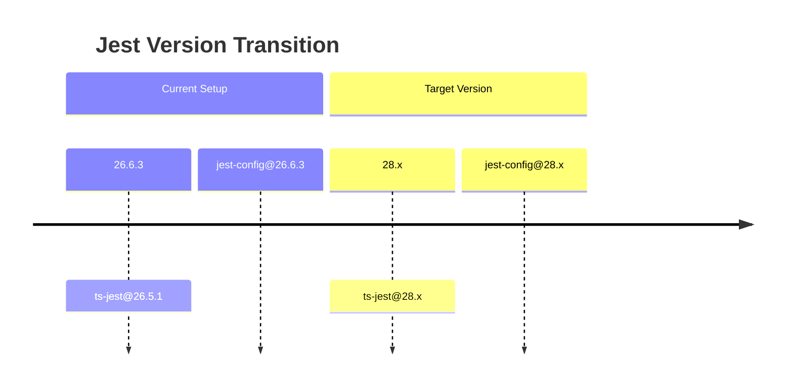
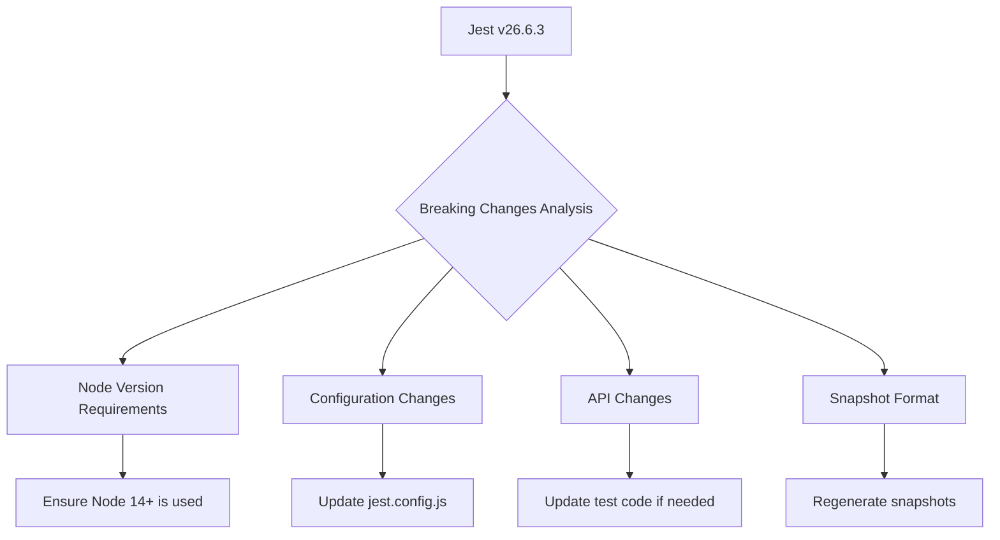
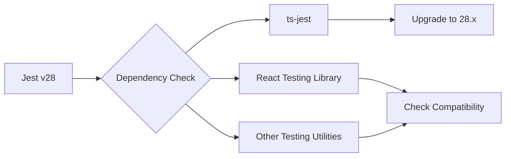
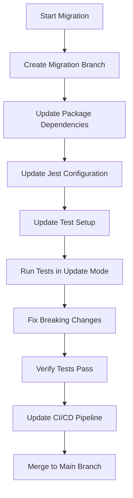

# Jest v26 to v28 Migration Plan

## 1. Version Gap Analysis



### Key Version Changes
- Jest v27 (intermediate version)
  - Node 10 support dropped
  - CommonJS is now the default format for Jest's packages
  - New test runner architecture

- Jest v28 (target version)
  - Node 12 support dropped
  - ESM support improvements
  - New snapshot format
  - Improved test isolation

## 2. Breaking Changes Assessment



### Major Breaking Changes to Address:
1. **Node Version Requirements**: Jest v28 requires Node 14+
2. **Configuration Changes**: 
   - `testRunner` option is no longer needed (removed in v27)
   - Some options have been renamed or restructured
3. **Timer Mocks API Changes**: Changes in `jest.useFakeTimers()` configuration
4. **Mock Functions**: Changes in how mock functions are configured and reset
5. **Snapshot Format**: Updated format may require regenerating snapshots

## 3. Dependency Compatibility Check



### Dependencies to Update:
- `jest`: ^28.0.0
- `jest-environment-jsdom`: ^28.0.0 (now separate package)
- `ts-jest`: ^28.0.0
- `@types/jest`: ^28.0.0
- Check compatibility with React Testing Library

## 4. Migration Steps



### Detailed Steps:

1. **Create a Migration Branch**
   - Create a dedicated branch for the Jest upgrade
   - This allows for isolated testing before merging

2. **Update Package Dependencies**
   ```bash
   npm uninstall jest jest-cli ts-jest @types/jest
   npm install --save-dev jest@^28.0.0 jest-cli@^28.0.0 jest-environment-jsdom@^28.0.0 ts-jest@^28.0.0 @types/jest@^28.0.0
   ```

3. **Update Jest Configuration**
   - Update `jest.config.js` with new syntax and options
   - Remove deprecated options
   - Add new required configurations

4. **Update Test Setup**
   - Review and update `scripts/setupTests.ts`
   - Check for any custom test environments that might need updates

5. **Run Tests in Update Mode**
   - Run tests with snapshot update flag: `jest --updateSnapshot`
   - This will update any existing snapshots to the new format

6. **Fix Breaking Changes**
   - Address timer mock API changes
   - Update mock function usage
   - Fix any other breaking changes discovered during testing

7. **Verify Tests Pass**
   - Ensure all existing tests pass after the migration
   - Check that test coverage remains the same or improves

8. **Update CI/CD Pipeline**
   - Update any CI/CD configurations to use the new Jest version
   - Verify CI/CD pipelines complete successfully

## 5. Required Codebase Modifications

### Configuration Updates
1. **jest.config.js Modifications**:
   ```javascript
   // Before (v26)
   module.exports = {
     // ...
     testRunner: 'jest-circus/runner',
     // ...
   }

   // After (v28)
   module.exports = {
     // ...
     // testRunner option removed
     // ...
   }
   ```

2. **Timer Mocks API**:
   ```javascript
   // Before (v26)
   jest.useFakeTimers()

   // After (v28)
   jest.useFakeTimers({
     legacyFakeTimers: true // For backward compatibility
   })
   
   // Or use the new API
   jest.useFakeTimers()
   ```

3. **Mock Reset Changes**:
   ```javascript
   // Before (v26)
   jest.resetAllMocks() // Resets all mocks including spies

   // After (v28)
   jest.resetAllMocks() // Only resets mocks created with jest.fn()
   jest.restoreAllMocks() // Restores all spies
   ```

## 6. Potential Risks and Mitigation Strategies

| Risk | Impact | Mitigation Strategy |
|------|--------|---------------------|
| Breaking changes in Jest APIs | Test failures | Identify all usage patterns before migration and update accordingly |
| Incompatibility with testing libraries | Test failures | Verify compatibility and upgrade testing libraries if necessary |
| Node version requirements | Build failures | Ensure Node 14+ is used in development and CI/CD environments |
| Snapshot differences | Failed snapshot tests | Run tests with `--updateSnapshot` flag |
| Testing patterns that rely on deprecated features | Test failures | Identify these patterns early and refactor to use new APIs |

## 7. CI/CD Pipeline Updates

1. **Verify Node Version**:
   - Ensure CI/CD environments use Node 14+

2. **Update Test Commands**:
   - Review and update test scripts in `package.json`
   - Update any custom test runners

3. **Update Caching Configurations**:
   - Update cache keys if they depend on Jest version

## 8. Post-Migration Verification

1. **Test Coverage Check**:
   - Verify that test coverage remains the same or improves
   - Run `jest --coverage` to generate coverage reports

2. **Performance Benchmark**:
   - Compare test execution time before and after migration
   - Identify any performance regressions

3. **Integration Testing**:
   - Verify that the upgraded Jest works with other tools in the project
   - Test the full CI/CD pipeline

## 9. New Features to Leverage

Jest v28 introduces several new features that can improve your testing workflow:

1. **Improved Test Isolation**:
   - Reduced test leakage between tests
   - Better error reporting for asynchronous errors

2. **Sharding Capability**:
   - Split test suites across multiple processes
   - Useful for large test suites to improve performance

3. **Enhanced ESM Support**:
   - Better support for ES Modules
   - Simplified configuration for ESM projects

4. **Improved Snapshot Format**:
   - More readable and maintainable snapshots
   - Better diff output for failed snapshot tests